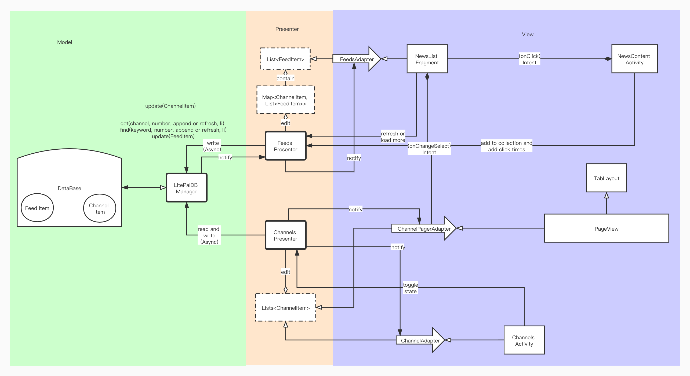
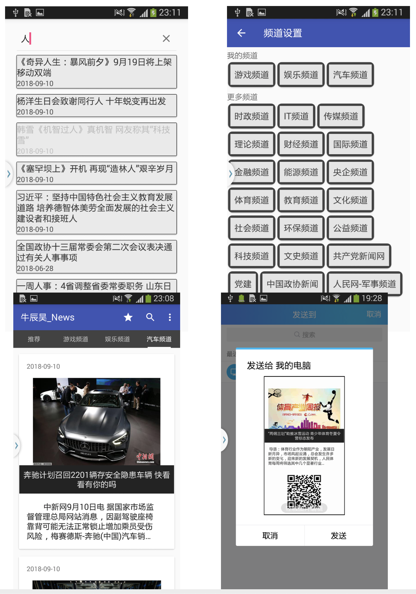

# Android RSS News Reader

*Tested on Android 5.0

## Features

* 基本浏览功能：
  * 通过人民日报RSS接口拉取新闻，显示新闻列表的摘要和图片
  * 点击摘要展开文字；点击标题进入新闻页面
  * 实现新闻的本地存储，看过的新闻列表在离线的情况下也可以浏览
  * 上拉获取更多新闻
  * 看过的新闻页面灰色标记
  * 提供搜索功能
* 分享与收藏：
	* 生成图片和二维码进行分享
	* 收藏的新闻储存在本地
* 推荐功能：
	* 根据用户看过的新闻展示推荐新闻
* 多语言支持：
	* 结合人民日报RSS的多语言接口，提供简体中文和英文两种语言，根据系统语言自动切换。
* 本地数据库：
	* 使用了 SQLite 作为本地数据库的后端， 通过Lite Pal库进行数据库操作， 避免了手动读写文件，使得用户数据更加便于管理，并可以一键清空。

## 程序架构

本程序的总体架构及业务逻辑如上图所示，从左到右分别为Model， Presenter， View层。这样的结构使得数据库、后端逻辑、前端逻辑可以相互解耦，各个层之间通过定义的基类或接口来连接。

## 应用截图

